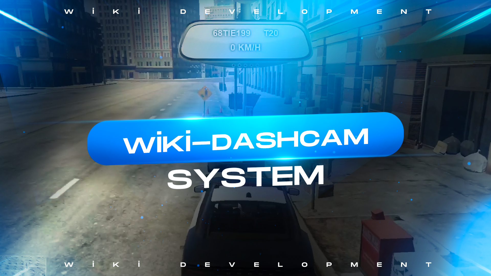

# wiki-dashcam

## in-game showroom
https://www.youtube.com/watch?v=kSCgRFPpxUU



## Usage
```lua
Config.PoliceCars = {
    [`t20`] = true,
    [`npolvic`] = true,
    [`npolexp`] = true,
    [`npolchal`] = true,
    [`npolvette`] = true,
    [`npolstang`] = true,
}
```
